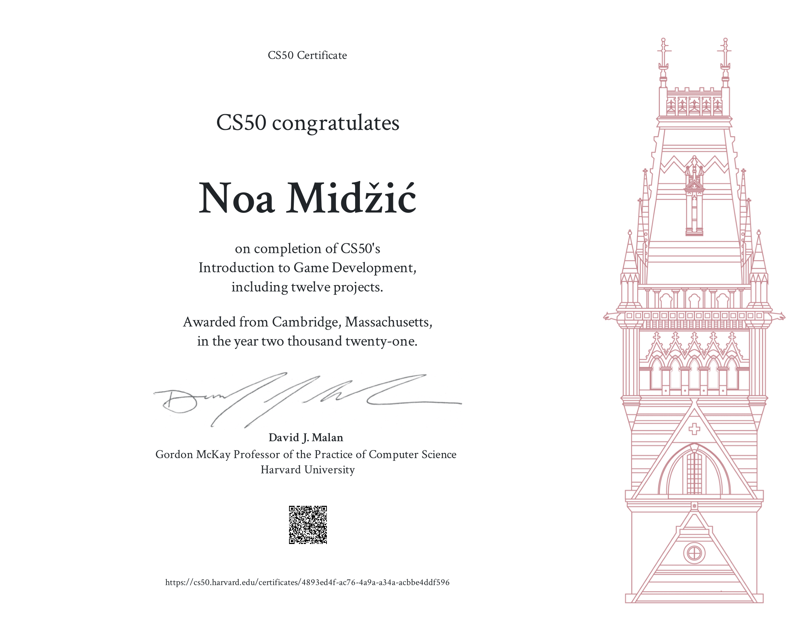

A simple 2D game with Lua using Love game engine, created for the final project for CS50 Harvard course.

# Description

The idea is based on a Japanese legend about willpower, where a carp that reached the waterfall became a dragon. The gameplay is divided in two parts. In the first, the player controlling a carp sprite must navigate it through the river, avoiding the dangers and the enemies such as bigger fish, otters and hooks. However, the smaller fish can be eaten by the carp and whenever the carp does it, it will grow a bit. This is important because only when it reaches a certain size will the player be able to proceed to part two of the gameplay (the waterfall). In part two, the carp is swimming upwards through the waterfall, and its only task is to avoid the rocks. When it reaches the top of the waterfall (after an alloted time determined by the game), the carp becomes the dragon and the game is won, ends with outro narration/pictures.

In both parts of the gameplay, all the sprites will increase in both size and speed, so the longer the game is played, the harder it becomes. However, the player's carp will also boost slightly in speed through time to compensate for the added difficulty.

If the player loses (by colliding with an otter, bigger fish, rock, or getting caught on a hook) the game will restart by switching back to title screen, but without the intro narration this time, only the prompt "start game" by pressing spacebar. (The intro narration is played only once at the beginning of each new game launch.)

Music (from free music archive) is added, as are sound effects (blip for eating smaller fish and explosion for colliding with an enemy/obstacle).

All the backgrounds and the sprites seen on the screen were drawn by me in Paint, and the final two pictures of the carp and of the dragon at the end of the game were also hand-drawn by me.

# Demo

# Certificate

