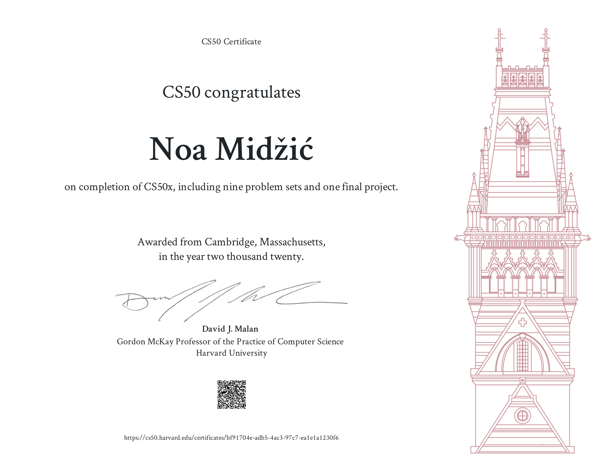

A simple 2D game with Lua using LOVE2D game engine, created for the final project for CS50 Harvard course.

To play on Windows, run `game.exe` file from `exe` folder (antivirus might prevent). Alternatively, install LOVE2D engine and drag `game` folder onto the LOVE2d shortcut.

# Description

The idea is based on a Japanese legend about willpower, where a carp that reached the waterfall became a dragon.

The gameplay is divided in two parts. In the first, the player controlling a carp sprite must navigate it through the river, avoiding the dangers and the enemies such as bigger fish, otters and hooks. However, the smaller fish can be eaten by the carp and each time the carp will grow a bit. Only when it reaches a certain size will the player be able to proceed to part two of the gameplay, the waterfall.

In part two, the carp is swimming upwards through the waterfall, and its only task is to avoid the rocks. When it reaches the top of the waterfall, the carp becomes the dragon and the game is won.

In both parts of the gameplay, all the sprites will increase in both size and speed, so the longer the game is played, the harder it becomes. However, the player's carp will also boost slightly in speed through time to compensate for the added difficulty.

If the player loses (by colliding with an otter, bigger fish, rock, or getting caught on a hook) the game will switch back to title screen.

# Credits

Music and sound effects are from free archives, credits listed in the code.

All the visuals (backgrounds, sprites, and pictures) are original, either created in Paint or hand-drawn.

# Demo

[Video](https://www.dropbox.com/scl/fi/wftii14jkke17v0e4rcdd/CarpToDragon.mp4?rlkey=qvryrpshflckwglrtamzluz8d&dl=0)

# Certificate

